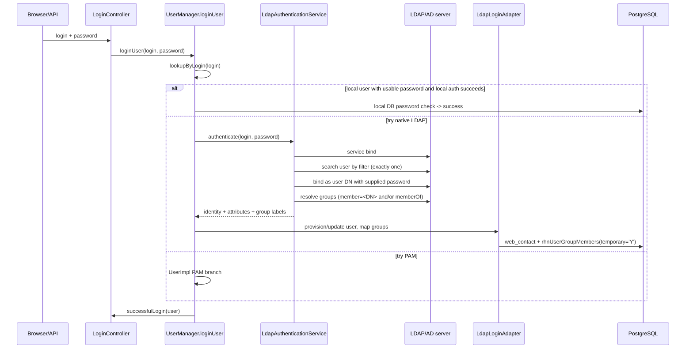
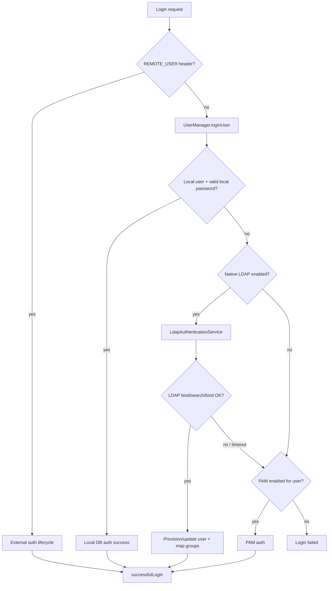
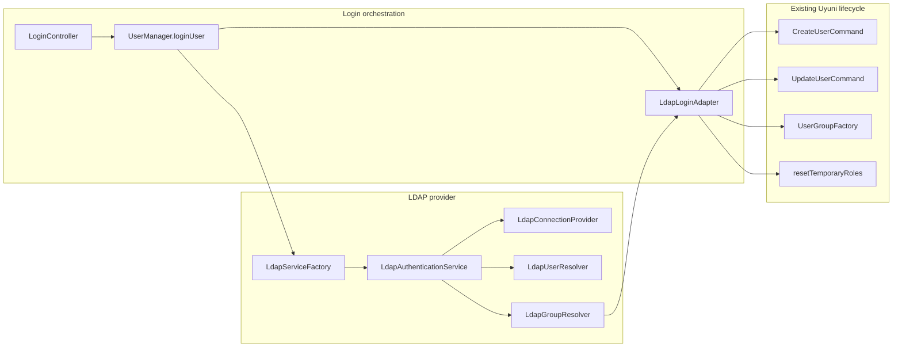
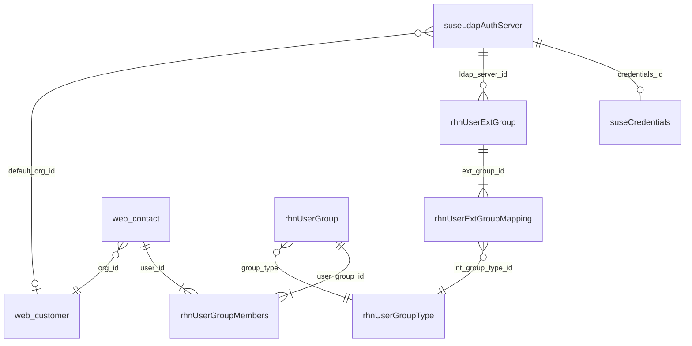

- Feature Name: native_ldap_authentication
- Start Date: 2026-06-03

# Summary
[summary]: #summary

Add a native, Java-based LDAP/Active Directory authentication provider to Uyuni's web application. Administrators configure the directory connection from Uyuni itself instead of relying on the host operating system (SSSD/PAM) or a reverse proxy. A successful LDAP login can optionally create or update the Uyuni user, and LDAP group membership is mapped to Uyuni roles by reusing and reviving the existing external-group mapping mechanism (`rhnUserExtGroup` / `rhnUserExtGroupMapping`) together with the temporary-role lifecycle already used by header-based external authentication.

This RFC also records the design questions that need wider input, so the core team and senior contributors can comment directly on the proposed decisions.

# Motivation
[motivation]: #motivation

Today Uyuni can authenticate against a directory only *indirectly*:

- **PAM/SSSD**: the host OS is configured for LDAP, and Uyuni delegates the password check to PAM (`WEB_PAM_AUTH_SERVICE` + per-user `usePamAuthentication`). The LDAP configuration lives in `sssd.conf` on the server, edited over the CLI, outside Uyuni.
- **Header-based external auth** (`REMOTE_USER`): a front-end web server / IdP authenticates the user and passes identity and group headers. Uyuni trusts those headers (`LoginHelper.checkExternalAuthentication`).

Both work, but the directory integration itself is invisible to Uyuni: an administrator cannot configure it, test it, or troubleshoot it from the product, and there is no first-class, managed concept of an "LDAP group" inside Uyuni. The external-group string is consumed transiently during a `REMOTE_USER` login and then discarded.

The goal of this feature is to bring directory integration *into* Uyuni:

- Administrators configure LDAP/AD from the Web UI and API.
- LDAP users authenticate with directory credentials; local Uyuni users keep working unchanged.
- LDAP groups map to Uyuni roles automatically, using the same role tables the rest of Uyuni already reads.
- Connection and mapping can be tested from the UI before going live.

Expected outcome: an administrator can point Uyuni at an Active Directory / FreeIPA / OpenLDAP server, optionally enable just-in-time user creation, map a directory group such as `uyuni-admins` to the Org Admin role, and have those users log in and receive the right roles — without touching `sssd.conf`.

# Detailed design
[design]: #detailed-design

## Proof of work behind this design

The decisions in this RFC are grounded in concrete exploration done during community bonding:

1. **Auth-flow code reading.** The current login path was traced end to end: `LoginController.performLogin()` → `LoginHelper.checkExternalAuthentication()` → `UserManager.loginUser()` → `UserImpl.authenticate()` (PAM branch vs local DB branch) → `LoginHelper.successfulLogin()`. The external-auth lifecycle (`newRemoteUser`, `updateRemoteUser`, `getRolesFromExtGroups`, `getSgsFromExtGroups`, `getExtGroups`) and the temporary-role mechanism (`UserManager.resetTemporaryRoles`, `UserGroupFactory`) were identified as the closest existing precedent.
2. **LDAP SDK spike.** A standalone Java program (`tooling/ldap-poc`, UnboundID LDAP SDK 7.0.4, Java 17) was written and run against a seeded OpenLDAP fixture (`tooling/dev-ldap`, `osixia/openldap:1.5.0`). It validated the exact operations this design depends on: service-account bind, pooled connections, user search by `uid`, group resolution via `(member=<userDN>)` **without** a `memberOf` overlay, a successful user credential bind, and a correctly rejected wrong-password bind.
3. **Deploy-loop validation.** The build → deploy → restart → verify loop for Java changes in the containerized server was exercised (`mvn package`, `mgrctl cp` of `rhn.jar`, Tomcat restart). This surfaced a pre-existing test-compilation breakage that the testing plan below accounts for.
4. **Reference implementation review.** Red Hat Satellite 6 / Foreman already ship native LDAP. Their configuration model (server-type-driven attribute defaults, just-in-time account creation, an auth-source-level LDAP filter, external user-group → role binding, and multiple group-sync strategies) is used as a UX reference because Satellite shares Uyuni's Spacewalk lineage.

## Existing authentication flow

```text
Browser / API client
  -> LoginController.performLogin()
     -> LoginHelper.checkExternalAuthentication()        (REMOTE_USER header path)
     -> if no external user:
        -> UserManager.loginUser(login, password)
           -> UserFactory.lookupByLogin(login)
           -> UserImpl.authenticate(password)
              -> PAM   (if WEB_PAM_AUTH_SERVICE set and user.usePamAuthentication)
              -> local DB password check otherwise
     -> LoginHelper.successfulLogin()
```

Two existing patterns are reused rather than reinvented:

- **The PAM service/factory shape** (`PamServiceFactory` → `DefaultPamServiceFactory` → `PamServiceWrapper`) is the structural template for isolating an external credential check behind a factory.
- **The external-auth lifecycle** in `LoginHelper` already performs just-in-time user creation (`CreateUserCommand`), profile updates (`UpdateUserCommand`), external-group → role mapping (`UserGroupFactory.lookupExtGroupByLabel`), and temporary-role assignment. This is the model for LDAP user/role lifecycle.

## Proposed architecture

LDAP authentication is implemented as a service behind a factory, mirroring the PAM pattern, with the user lifecycle handled at the login-orchestration layer (so just-in-time provisioning and role mapping are possible):

```text
LdapServiceFactory            (selects the configured implementation; testable seam)
  -> LdapAuthenticationService
       -> LdapConnectionProvider   (UnboundID LDAPConnectionPool, TLS, timeouts, failover)
       -> LdapUserResolver         (bind/search/bind, attribute extraction)
       -> LdapGroupResolver        (member= search and/or memberOf, normalization)
  -> LdapLoginAdapter            (maps the LDAP result onto the existing lifecycle:
                                  CreateUserCommand / UpdateUserCommand /
                                  UserManager.resetTemporaryRoles)
```

Class names are indicative; the responsibilities (connection, user lookup, group lookup, and mapping onto the Uyuni user lifecycle) are the design contract.



## Login ordering

Per mentor guidance, the credential resolution order for username/password login is:

```text
Local DB  ->  Native LDAP  ->  PAM
```

Concretely, in `UserManager.loginUser` (after the existing `REMOTE_USER` external-auth check that already runs first in `LoginController`):

1. Look up the user by login. If a local user exists **and** has a usable local password **and** that password verifies, log in locally.
2. Otherwise attempt native LDAP (bind/search/bind). On success, provision-or-update the user and map groups → temporary roles, then log in.
3. Otherwise attempt PAM (unchanged behavior).
4. Otherwise fail with a single generic message (see Failure modes).

This ordering is why the LDAP step lives at the orchestration layer and not solely inside `UserImpl.authenticate()`: step 2 may need to create a user that does not yet exist locally, and `UserImpl.authenticate()` runs only after `UserFactory.lookupByLogin()` has already found one.

## LDAP authentication flow

The provider uses the standard bind/search/bind sequence, validated in the POC:

1. Bind with the configured service account (or anonymous bind if explicitly enabled).
2. Search for the user under the configured user base DN using the configured filter; require **exactly one** match.
3. Bind as the discovered user DN with the password supplied at login.
4. Resolve the user's groups.
5. Return the normalized login, profile attributes, and group labels to the lifecycle adapter.

User input is never concatenated into a filter; values are escaped (the POC uses `Filter.createEqualityFilter`, which escapes automatically).

Example configuration values (server-type defaults shown for AD):

```text
ldap.enabled            = true
ldap.server_type        = ACTIVE_DIRECTORY        # or FREE_IPA / OPENLDAP / POSIX
ldap.url                = ldaps://ad.example.com:636
ldap.bind_dn            = CN=uyuni-reader,OU=Service,DC=example,DC=com
ldap.user_base_dn       = OU=Users,DC=example,DC=com
ldap.user_filter        = (&(objectClass=user)(sAMAccountName={login}))
ldap.login_attribute    = sAMAccountName           # uid for FreeIPA/OpenLDAP/POSIX
ldap.firstname_attribute= givenName
ldap.lastname_attribute = sn
ldap.email_attribute    = mail
ldap.group_base_dn      = OU=Groups,DC=example,DC=com
ldap.group_filter       = (&(objectClass=group)(member={userDn}))
ldap.group_name_attribute = cn
ldap.auth_filter        =                          # optional pre-auth scope filter
ldap.provisioning_mode  = JIT                      # default; EXISTING_ONLY opt-in
ldap.default_org_id     = 1
```

Selecting `server_type` pre-fills the attribute/filter defaults (AD vs IPA/POSIX), mirroring Satellite's behavior, so administrators rarely type raw attribute names.

## User lookup and provisioning

Two modes, controlled by `provisioning_mode`:

- **EXISTING_ONLY**: LDAP authenticates only users that already exist in `web_contact`. Simpler and safer; no org-assignment decision at login.
- **JIT** (just-in-time): a successful LDAP login creates the Uyuni user if absent, reusing `CreateUserCommand` exactly as `LoginHelper.newRemoteUser` does today (login set, non-usable placeholder password, attributes, org, temporary roles).

**Proposed default: `JIT`.** See reasoning under Organization assignment above (Q6). `EXISTING_ONLY` remains available for deployments that require manual user creation before first LDAP login.

Organization assignment for JIT users: start with a single configured **default org** (`ldap.default_org_id`), mirroring the existing `EXTAUTH_DEFAULT_ORGID` precedent. Attribute- or group-based org mapping is a later enhancement.

**Proposed default (Q6): `JIT`.** Just-in-time provisioning should be the default when LDAP is enabled, with `EXISTING_ONLY` as an explicit conservative opt-in. Rationale: the GSoC goal and Satellite/Foreman both assume directory users can log in without a pre-created Uyuni account; `LoginHelper.newRemoteUser` already implements this lifecycle for external auth. Requiring pre-created users defeats the main enterprise AD use case. Mitigation: when `provisioning = JIT`, the UI must require a valid `default_org_id` before saving, and the first login message should explain that roles come from LDAP group mappings (matching Satellite's "no permissions until mapped" UX).

## Profile attribute synchronization

On each successful LDAP login, selected profile fields (first name, last name, email) are refreshed from LDAP, reusing `UpdateUserCommand` as `updateRemoteUser` does. Missing LDAP attributes do not overwrite existing Uyuni values. Attribute names are configurable per server type.

## LDAP group resolution

The POC proved that group-side search works without server-side `memberOf`, so the portable baseline is:

```text
(&(objectClass=groupOfNames)(member=<userDN>))     # OpenLDAP / generic
(&(objectClass=group)(member=<userDN>))            # Active Directory
```

`memberOf` on the user entry is supported as an optional optimization for directories that expose it (common in AD; requires the memberOf overlay in OpenLDAP). Nested groups are AD-specific (the `LDAP_MATCHING_RULE_IN_CHAIN` OID `1.2.840.113556.1.4.1941`) and are proposed as a later iteration rather than v1.

## Group name normalization

LDAP groups may appear as full DNs or simple names. Proposed default: normalize to a configured attribute (`cn`) for easy mapping to Uyuni roles, with full-DN matching available where simple names are ambiguous. This matches Satellite, where admins are advised to name the Uyuni-side group identically to the directory group.

## Role mapping

LDAP group → Uyuni role mapping **reuses the existing external-group mechanism** rather than inventing a new RBAC model. Per mentor confirmation: `rhnUserGroup` remains the role-assignment model; `rhnUserExtGroup` / `rhnUserExtGroupMapping` are dormant but reusable (the related code exists but is not actively maintained, so it may need fixing); `access.accessGroup` is the authorization layer for new endpoints, not the LDAP role target.

Mapping flow (reusing real methods seen in `LoginHelper`):

```text
LDAP groups
  -> normalize to external-group labels
  -> UserGroupFactory.lookupExtGroupByLabel(label)        (rhnUserExtGroup -> rhnUserExtGroupMapping)
  -> resolve org-scoped rhnUserGroup rows (the roles)
  -> assign as temporary roles via CreateUserCommand/UpdateUserCommand.setTemporaryRoles
  -> on each login, UserManager.resetTemporaryRoles recomputes the set
```

Permanent, manually assigned Uyuni roles are never removed by LDAP login. Only temporary (LDAP-derived) roles are recomputed, so a user removed from a directory group loses the corresponding Uyuni role on next login. The existing `EXTAUTH_KEEP_TEMPROLES` switch (managed by `UserExternalHandler.setKeepTemporaryRoles`) governs whether temporary roles survive a later non-LDAP login.

**Making the LDAP group a first-class concept.** Today the external-group label only exists transiently. This RFC proposes promoting it to a managed entity: the `rhnUserExtGroup` row becomes the persisted representation of a known LDAP group, optionally scoped to a specific LDAP server (see Database design), and managed from the Admin UI/API. This is the "group concept that does not exist yet" that the feature introduces.

**Proposed approach (Q2): revive tables and shared mapping logic; add a new LDAP adapter.** Do not introduce parallel LDAP-only mapping tables. Do not rewrite the `REMOTE_USER` path in v1. Instead:

- keep `rhnUserExtGroup`, `rhnUserExtGroupMapping`, and the existing Admin/API surfaces (`UserExternalHandler`, `ExtGroupDetailAction`);
- add `LdapLoginAdapter`, which normalizes LDAP group labels and calls the same resolution path as `LoginHelper.getRolesFromExtGroups()` / `UserGroupFactory.lookupExtGroupByLabel()`;
- add integration tests that exercise dormant code paths and fix regressions found there.

Evidence: schema and triggers still exist; `UserGroupFactory` exposes list/lookup/save/delete; `LoginHelper.getRolesFromExtGroups` is ~10 lines and already maps labels → roles. Mentor guidance: "you can reuse those existing tables where it helps." Trade-off: reviving dormant code may surface latent bugs (acceptable with tests); a fresh table duplicates mentor intent and forfeits existing UI/API.

## RBAC integration

The new RBAC model (`access.namespace`, `access.endpoint`, `access.accessGroup`) is used only to **protect the new LDAP configuration endpoints**. The LDAP setup pages and API methods must be registered in the RBAC endpoint mapping so only appropriately privileged administrators can read or change LDAP configuration. LDAP-derived user roles continue to flow through `rhnUserGroup`. Automatic population of `access.accessGroup` from LDAP groups is explicitly out of scope for v1 and listed as a future direction.

## Database design

### Reused tables

| Table | Use |
| --- | --- |
| `web_contact` | user identity; JIT users get a non-usable placeholder password (as `REMOTE_USER` users do) |
| `rhnUserGroup` / `rhnUserGroupType` | org-scoped role instances (unchanged) |
| `rhnUserGroupMembers` | role membership; `temporary='Y'` for LDAP-derived roles |
| `rhnUserExtGroup` / `rhnUserExtGroupMapping` | external group → role mapping (revived) |
| `rhnOrgExtGroupMapping` | optional external group → server-group mapping |
| `rhnConfiguration` | simple flags, following the `EXTAUTH_*` precedent |

### New table (proposed)

A connection-configuration table holds one row per configured directory (multiple servers allowed). `server_type` is a Java enum (as CoCo attestation models `env_type`), not a DB lookup table.

```sql
CREATE TABLE suseLdapAuthServer (
    id              NUMERIC NOT NULL
                      CONSTRAINT suse_ldapauth_id_pk PRIMARY KEY,
    label           VARCHAR(128) NOT NULL,
    enabled         CHAR(1) NOT NULL DEFAULT 'Y'
                      CONSTRAINT suse_ldapauth_enabled_ck CHECK (enabled IN ('Y','N')),
    server_type     VARCHAR(32)  NOT NULL,         -- ACTIVE_DIRECTORY | FREE_IPA | OPENLDAP | POSIX
    host            VARCHAR(256) NOT NULL,
    port            NUMERIC      NOT NULL DEFAULT 636,
    transport       VARCHAR(16)  NOT NULL DEFAULT 'LDAPS'  -- LDAPS | STARTTLS | PLAIN
                      CONSTRAINT suse_ldapauth_transport_ck CHECK (transport IN ('LDAPS','STARTTLS','PLAIN')),
    bind_dn         VARCHAR(512),                  -- null => anonymous bind
    credentials_id  NUMERIC NULL
                      CONSTRAINT suse_ldapauth_cred_fk REFERENCES suseCredentials (id),
    -- bind password lives in suseCredentials (type ldap), not in this table
    user_base_dn    VARCHAR(512) NOT NULL,
    user_filter     VARCHAR(512) NOT NULL,
    login_attr      VARCHAR(64)  NOT NULL,
    firstname_attr  VARCHAR(64),
    lastname_attr   VARCHAR(64),
    email_attr      VARCHAR(64),
    group_base_dn   VARCHAR(512),
    group_filter    VARCHAR(512),
    group_name_attr VARCHAR(64)  DEFAULT 'cn',
    use_member_of   CHAR(1)      NOT NULL DEFAULT 'N',
    auth_filter     VARCHAR(512),                  -- optional pre-auth scope filter
    provisioning    VARCHAR(16)  NOT NULL DEFAULT 'JIT'
                      CONSTRAINT suse_ldapauth_prov_ck CHECK (provisioning IN ('EXISTING_ONLY','JIT')),
    default_org_id  NUMERIC
                      CONSTRAINT suse_ldapauth_org_fk REFERENCES web_customer (id),
    connect_timeout NUMERIC      NOT NULL DEFAULT 5000,   -- ms (mentor: 3-5s)
    created         TIMESTAMPTZ  DEFAULT (current_timestamp) NOT NULL,
    modified        TIMESTAMPTZ  DEFAULT (current_timestamp) NOT NULL
);
CREATE SEQUENCE suse_ldapauth_id_seq;
CREATE UNIQUE INDEX suse_ldapauth_label_uq ON suseLdapAuthServer (label);
```

To make external groups first-class and LDAP-scoped, an optional nullable FK is proposed on the existing external-group table:

```sql
ALTER TABLE rhnUserExtGroup
    ADD COLUMN ldap_server_id NUMERIC NULL
        CONSTRAINT rhn_uextgrp_ldapsrv_fk REFERENCES suseLdapAuthServer (id);
```

A null `ldap_server_id` preserves today's behavior (server-agnostic label, used by `REMOTE_USER`); a set value scopes the mapping to a specific directory. This is a design question flagged below.

## Configuration storage and secret handling

Connection settings live in `suseLdapAuthServer` (DB-backed, manageable from UI/API), not in `rhn.conf`, because the feature is explicitly about UI configurability and supports multiple servers. Simple global flags may still use `rhnConfiguration` to match the `EXTAUTH_*` precedent.

**Proposed approach (Q1): extend `suseCredentials` with type `ldap`.** Uyuni already stores server-side secrets in `suseCredentials` via Hibernate subclasses of `PasswordBasedCredentials` (`SCCCredentials`, `RegistryCredentials`, etc.). Passwords are Base64-encoded at rest in the `password` column — not strong encryption, but this is the established Uyuni pattern for SCC, registry, and cloud RMT credentials.

Proposed shape:

```text
suseLdapAuthServer.credentials_id  ->  suseCredentials (type = 'ldap')
                                         username = bind DN (or service account name)
                                         password = Base64(bind password)
```

Implementation steps:

1. Add `'ldap'` to the `suseCredentials.type` CHECK constraint and `CredentialsType` enum.
2. Add `LdapCredentials extends PasswordBasedCredentials`.
3. On LDAP server save, create/update the linked credentials row; never return the password in list/get API responses (write-only in UI, as SCC credentials behave).

Evidence: `schema/spacewalk/common/tables/suseCredentials.sql`, `PasswordBasedCredentials.setPassword()` (Base64), `CredentialsFactory`. Podman secrets (`uyuni-db-pass`, etc.) are install-time container secrets, not suitable for runtime admin-configured LDAP bind passwords from the Web UI.

Trade-offs:

| Approach | Pros | Cons |
| --- | --- | --- |
| **`suseCredentials` + Base64 (proposed)** | Matches SCC/registry; existing DAO patterns; backup/restore with DB | Base64 is obfuscation, not encryption |
| Plain column on `suseLdapAuthServer` | Simpler schema | Duplicates secret handling; inconsistent with Uyuni |
| Podman/K8s secret | Strong isolation | Not manageable from Web UI; wrong fit for this feature |
| New encryption layer | Stronger at-rest security | New crypto/key-management design; out of GSoC scope unless security team requires it |

Open question for reviewers: whether Base64-at-rest is acceptable for LDAP bind passwords or whether `extra_auth` / a dedicated encryption step is required (see Unresolved questions).

## Transport security

Production deployments must use encrypted transport (`LDAPS` or `STARTTLS`). `PLAIN` is allowed only for explicit dev/test (the POC fixture uses plain LDAP on loopback). Trust material is validated against the JVM trust store; because the server runs in a container that already mounts CA anchors at `/etc/pki/trust/anchors/`, the proposal is to let administrators add the directory's CA there (or upload it through the UI). Exact trust-store integration is flagged as a design question.

## Connection handling

The POC validated `LDAPConnectionPool`. The provider will:

- use a pooled service connection for search operations,
- open a short-lived dedicated connection for each user credential bind,
- apply a connect/response timeout of 3–5s (mentor-confirmed) so an unreachable directory fails fast,
- support multiple servers via UnboundID's `FailoverServerSet` / `RoundRobinServerSet` for HA (later iteration).

## Failure modes

Behavior confirmed with the mentor:

| Situation | Behavior |
| --- | --- |
| Active session, LDAP goes down | Unaffected — LDAP is checked only at login, never mid-session |
| Local user logs in, LDAP down | Unaffected — local auth is first and independent |
| LDAP user logs in, LDAP unreachable | Fail after the 3–5s timeout; show "Invalid credentials or directory unreachable, please try again later" |
| LDAP user, wrong password | Reject (invalid credentials) |
| LDAP user exists in directory but also has a local password | **No** silent fallback to local after LDAP failure (security decision) |
| User search returns 0 or >1 entries | Treat as authentication failure (ambiguous) |
| Group lookup fails after successful bind | Authenticate, but assign no LDAP-derived roles; log the failure |
| User maps to no Uyuni roles | Login succeeds with no temporary roles (admin assigns roles or fixes mapping) |

The generic failure message intentionally does not distinguish "user unknown" from "wrong password" from "server down" to avoid user enumeration; details go to the server log.

## User interface

A new **Admin → Setup → LDAP** area, structured after Satellite's proven four-tab layout:

1. **Server** — label, host, port, transport (LDAPS/StartTLS/Plain), server type.
2. **Account** — bind DN + password, user/group base DN, user filter, auth filter, provisioning mode, default org.
3. **Attribute mappings** — login / first name / last name / email / group-name attributes (pre-filled from server type).
4. **User Groups** — external group → role bindings (extending the existing `ExtGroupDetailAction` UI).

Three test actions map directly onto operations already proven in the POC and give administrators immediate feedback before enabling LDAP:

- **Test connection** — service bind (POC: `LDAPConnection` + pool).
- **Test user lookup** — search a sample login (POC: `findUser`).
- **Test group resolution** — resolve a sample user's groups (POC: `findGroups`).

First-login UX matches Satellite: a freshly provisioned LDAP user with no mapped groups logs in with no permissions until roles are assigned or a group mapping matches.

All new endpoints are registered with the RBAC endpoint mapping and restricted to product/org administrators.

## API

Following the HTTP-API RFC convention, every capability is exposed over both interfaces:

- **XML-RPC**: extend the existing `user.external` namespace (`UserExternalHandler`) for group→role mappings, and add an `auth.ldap` (or similar) namespace for server CRUD and the test operations.
- **JSON over HTTP**: the same handlers, auto-exposed via the Spark route wrapper, `@ReadOnly` on the test/get methods.

## Diagrams

The following diagrams should be exported to PNG under `accepted/images/` when opening the RFC PR (see `tooling/ldap-rfc-pr-structure.md`).

### Login and credential resolution



### Component architecture



### Database relationships (proposed)



### POC validation (proof of work)

Operations validated in `tooling/ldap-poc` against `tooling/dev-ldap`:

```text
Connected to ldap://127.0.0.1:1389
User: uid=alice,ou=users,dc=uyuni,dc=test
Groups: uyuni-admins, uyuni-users
Bind as alice: success
Bind as alice with wrong password: rejected
```

This confirms the portable group lookup `(member=<userDN>)` without a `memberOf` overlay.

## Phasing

The feature is deliberately split so each iteration is independently reviewable and testable:

- **Iteration 1 — backend authentication.** `LdapServiceFactory` + `LdapAuthenticationService`; bind/search/bind; `EXISTING_ONLY` mode; Local → LDAP → PAM ordering; minimal config; unit + integration tests against the fixture.
- **Iteration 2 — provisioning + roles.** JIT user creation, profile sync, group→role mapping reusing `rhnUserExtGroup`, temporary-role reset.
- **Iteration 3 — UI + API.** Four-tab Admin UI, test-connection/lookup/group actions, XML-RPC + JSON endpoints, RBAC registration.
- **Iteration 4 — advanced.** Auth-source filter, multiple servers/failover, `memberOf` + AD nested groups, additional group-sync strategies (scheduled refresh / manual refresh, as Satellite offers).

## Testing

- **Local fixture** (already built): `tooling/dev-ldap` seeded with `alice`/`bob` and `uyuni-admins`/`uyuni-users`.
- **Unit tests**: filter construction/escaping, attribute mapping, group normalization, role-mapping logic, temporary-role reset.
- **Integration tests**: bind/search/group/credential paths against the fixture (the POC is the seed for these).
- **Regression**: local and PAM logins must be unaffected; ordering must be exercised.
- **Known risk**: the core test tree currently has pre-existing compile breakage (`RhnMockHttpServletHttpServletResponse`, `SimpleTestingResponse`) that forced `-Dmaven.test.skip` during the deploy spike. New LDAP tests must build cleanly; whether the broken pre-existing tests are fixed as part of this work is a question for the maintainers.

# Drawbacks
[drawbacks]: #drawbacks

- It adds code to a security-sensitive path; mistakes in ordering, fallback, filter escaping, or mapping could cause auth/authz bugs.
- It introduces a new runtime dependency on an external directory; timeouts and failure modes must be disciplined.
- It likely adds a new third-party Java dependency (UnboundID LDAP SDK) that must clear licensing/packaging review.
- It revives dormant `rhnUserExtGroup` code that may no longer be functional and will need repair and test coverage.
- LDAP/AD deployments vary widely; v1 must pick clear defaults and document its limits rather than support every schema.

# Alternatives
[alternatives]: #alternatives

- **Stay on PAM/SSSD only.** No new code in Uyuni, but no in-product configuration, testing, profile sync, or group→role mapping. Rejected as not meeting the goal.
- **Improve only header-based `REMOTE_USER`.** Keeps auth outside Uyuni and still needs a reverse proxy/IdP; no in-product LDAP visibility. Rejected for the same reason.
- **Add LDAP only inside `UserImpl.authenticate()`.** Minimal, mirrors the PAM branch, but cannot do first-login provisioning (lookup precedes authenticate). Viable only for an `EXISTING_ONLY` v1; rejected as the primary shape because JIT is a core requirement.
- **JNDI instead of UnboundID.** No third-party dependency, but a lower-level, more verbose API; harder pooling/StartTLS/testability. Considered as the fallback if UnboundID is not acceptable.
- **Apache Directory LDAP API / Spring LDAP.** Reasonable alternatives to UnboundID; to be compared on packaging, licensing, and maintenance if UnboundID is rejected.

# Unresolved questions
[unresolved]: #unresolved-questions

Design questions for core-team / senior-contributor review. **Proposed decisions** for Q1, Q2, and Q6 are documented inline above; confirm or override in PR comments.

1. **Bind-password storage (Q1 — proposed: `suseCredentials` type `ldap` + Base64).** Is Base64-at-rest (same as SCC/registry credentials) acceptable for LDAP bind passwords, or does the security team require encryption via `extra_auth` or another mechanism?
2. **Revive vs reimplement external-group code (Q2 — proposed: revive tables + shared mapping; new `LdapLoginAdapter` only).** Should the dormant `REMOTE_USER` code paths be refactored in the same change, or left untouched until LDAP tests prove the shared helpers work?
3. **Scoping external groups to a server.** Is the proposed nullable `rhnUserExtGroup.ldap_server_id` FK the right way to make external groups first-class and LDAP-scoped, or should mappings stay server-agnostic as today?
4. **Superuser reachability.** May an LDAP group ever grant the SUSE Manager / Org Admin top-level role, or should the highest privileges remain local-only with LDAP capped below them?
5. **Org assignment for JIT users.** Is a single configured default org sufficient for v1, or is attribute-/group-based org mapping needed early?
6. **Default provisioning mode (Q6 — proposed: `JIT` default, `EXISTING_ONLY` opt-in).** Do reviewers agree, or should conservative deployments get `EXISTING_ONLY` as the shipped default?
7. **Nested groups.** Required in v1 for Active Directory, or acceptable as Iteration 4?
8. **Trust-store integration.** Where should the directory CA live — JVM trust store, the container's `/etc/pki/trust/anchors/`, or an upload-through-UI flow?
9. **`access.accessGroup` future.** Should the RFC commit to a future phase that maps LDAP groups into the new RBAC access groups, or leave that entirely out of scope?
10. **Primary target directory.** Which directory should be treated as the primary path for the test matrix and documentation — Active Directory, FreeIPA, or OpenLDAP?

Non-design questions (Gitter / packaging — not RFC review):

- Is the **UnboundID LDAP SDK** acceptable for Uyuni from a licensing and packaging standpoint?
- Should the pre-existing core test-compile breakage be fixed as part of this work or tracked separately?

# References
[references]: #references

[^1]: Uyuni RFC template — https://github.com/uyuni-project/uyuni-rfc/blob/master/00000-template.md
[^2]: RBAC RFC PR #95 — https://github.com/uyuni-project/uyuni-rfc/pull/95
[^3]: RBAC endpoint mapping wiki — https://github.com/uyuni-project/uyuni/wiki/RBAC-Endpoint-Mapping
[^4]: Spacewalk and IPA integration — https://github.com/spacewalkproject/spacewalk/wiki/SpacewalkAndIPA
[^5]: CVE auditing with OVAL RFC — https://github.com/uyuni-project/uyuni-rfc/blob/master/accepted/00098-cve-auditing-with-oval.md
[^6]: Confidential Compute Attestation RFC (DB/UI structure reference) — https://github.com/uyuni-project/uyuni-rfc/blob/master/accepted/00100-coco-attestation.md
[^7]: HTTP API RFC (API structure reference) — https://github.com/uyuni-project/uyuni-rfc/blob/master/accepted/00088-http-api.md
[^8]: LDAP Authentication in Satellite 6 (UX reference) — https://www.youtube.com/watch?v=gJAeRSE2IjQ
[^9]: UnboundID LDAP SDK — https://github.com/pingidentity/ldapsdk
